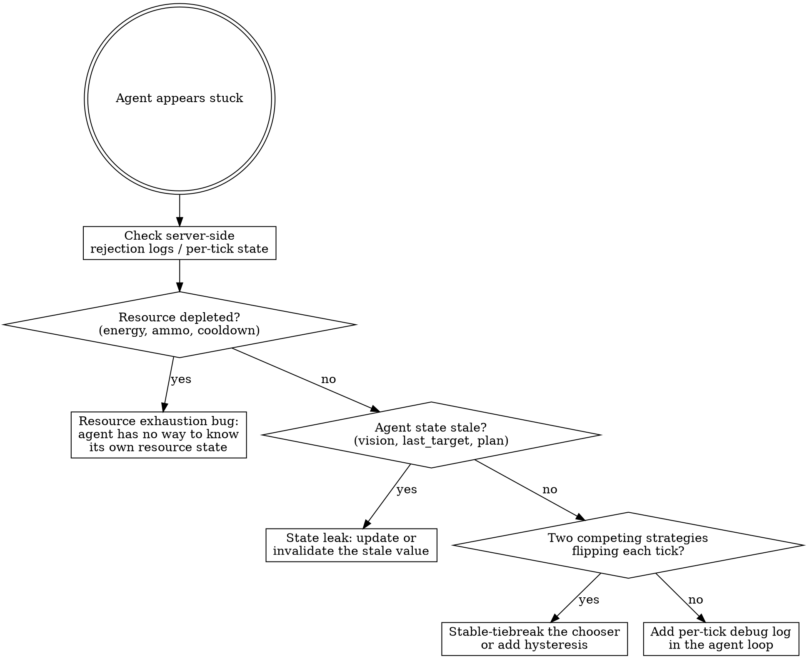

# debugging-stuck-game-agents

## When to invoke

The trigger is a watcher (user or you) reporting:
- "they were doing great then they all stopped"
- "they're just going back and forth in the same area"
- "they're stuck against the walls"
- "they stopped cooperating"
- "they look frozen but they're not crashed"
- "the bot is alive on the network but not doing anything useful"

Crucially, the agents are **still connected, still sending input** — they're not crashed, they're not disconnected, they're not idle. Something is making their inputs silently ineffective.

## Core principle

**"Frozen" is almost never a pathfinding bug.** Pathfinding bugs make agents do the WRONG thing (run into walls, target the wrong prey). When agents do NOTHING, the cause is almost always one of:

1. A server-side gate silently rejecting their actions (resource < cost)
2. State the agent depends on has gone stale (lost vision, stale path)
3. An oscillation between two equally-bad fallback strategies

These three look identical from outside (agent appears to do nothing useful) but the fixes are completely different. Diagnose before you patch.

## The diagnostic flow

## The resource-exhaustion case (most common)

Symptoms:
- Agent sends input every tick (network log shows packets)
- Position doesn't change
- Eventually one input "works" and the agent moves one tile
- ~Many ticks later, another input works in a different direction
- Looks like "back and forth in the same area, no direction"

This is the **cadence** signature: it's not pure freeze, it's one move per N seconds, where N matches some recharge interval on the server.

Math to do:
- What's the move cost?
- What's the recharge rate?
- How long does a session last?
- Does (move_cost × moves_per_round) > (recharge × round_length + starting_resource)?

If yes, the agent is **mathematically doomed** to deplete and then look frozen, regardless of strategy quality.

Fix isn't tactical, it's architectural: **the agent needs to know its own resource state and stop moving when low.** That requires the server to publish it (new packet field or query endpoint), the agent to parse it, and a rest-when-low gate. Cosmetic fixes like "make the bot smarter" don't address the root cause.

## The stale-state case

Symptoms:
- Agent suddenly starts walking the wrong way
- Was pursuing X, now ignoring X even though X is visible
- Lost a target and won't reacquire

Look for:
- Cached vision data that wasn't invalidated when the target moved/died
- A "current plan" variable that points at a now-impossible move
- An assumption like "I claimed slot N" that's no longer true (server reassigned)

## The oscillation case

Symptoms:
- Agent flips between two outputs each tick
- One observation: pathStep wants direction A, unstickStep wants direction B, they alternate
- Look like "twitching" rather than "moving"

Look for:
- Two strategies that disagree, with no stable tiebreak
- A threshold the agent is exactly at, flipping over/under each tick
- A randomized fallback that fires too eagerly

Fix: add hysteresis (different in-threshold vs out-threshold), or stable tiebreak (objectId, slot, deterministic hash).

## What to grab from the agent's environment

Before guessing, get:
1. **Last 50 inputs sent by the agent** (was it actually trying to move?)
2. **Server's response to those inputs** (did it accept them? if not, why?)
3. **Per-tick agent state** (current target, current mode, last_decision_reason)
4. **Resource snapshot** (energy, score, position) over time, not just at one moment

If the server doesn't expose this and you can't easily add it, that's the first thing to fix — without observability you're guessing in the dark.

## A real example

In stag_hunt, 7 `elephant_hunter` bots in an 8-hour interactive session ended with **all 7 at energy 0-1**. They appeared "stuck against walls, going back and forth." Diagnosis:

- Move cost: 2 energy per step
- Passive recharge: 1 per 18 ticks (= 1.33/sec at 24fps)
- Move cooldown: 5 ticks (so up to 4.8 moves/sec while moving = 9.6 energy/sec drain)
- Starting energy: 120
- Recharge cap: 100 (< start!)

→ Mathematically, a continuously-moving bot drains in ~14s. Recharge can't keep up. Trample damage (-30 per hit) made it worse.

**The fix wasn't "make the path planner smarter."** It was:
1. Server publishes `energy` in a new packet field (0x08) every tick
2. Bot parses it
3. Hysteretic rest gate: drop below 32 → sit still, climb back to 64 → rejoin

After fix: end-of-round energies 22-180 (was 0-1). Same strategy code. Same path planner. The fix was upstream — give the agent observability into its own state.

The temptation when watching the symptom was to mess with the pathfinder. That would have wasted a day.

## Common mistakes

- **Patching the pathfinder when the bug is resource exhaustion.** Pathfinder looks suspicious because that's where the "doesn't move" appears, but it's a downstream symptom.
- **Restarting the game to make the symptom go away.** Resets resource state. Bug returns later, you've learned nothing.
- **Trusting the agent's own logs.** If the agent doesn't know its state is bad, it won't log it. You need server-side state.
- **Adding random jitter as a "fix."** Random jitter sometimes appears to fix the symptom (agent now moves _somewhere_). It doesn't fix the underlying drain. Symptom returns at the next bottleneck.
- **Assuming "stuck" = "pathfinding."** Maps the bug to the most visible mechanism, not the actual cause.

## Red flags — STOP and re-diagnose

- "The pathfinder is broken" without checking per-tick server state
- "Let's just add a random unstick step" without identifying why it's stuck
- "It happens after a few minutes" without measuring the resource curve
- "Just respawn them" without checking what they look like 5 minutes after respawn
- "Add more diagnostics to the bot" without checking what the server already logs

## See also

- `investigating-game-balance` — broader scope, includes "are bots dying" as one of the cases
- `testing-game-balance-change` — once you've identified the fix, validate it
